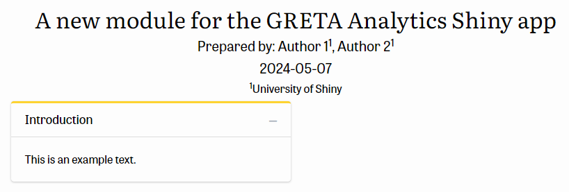

# How to contribute

## Report a bug or ask a question

If you have a question on the provided software or if you encounter a bug and you would like to report it, please open an [issue](https://github.com/JsLth/gretan/issues). 

### Before submitting a bug report
We kindly ask you to carefully investigate and describe your issue in detail. Please check the following questions before submitting a bug:

- Do you have the latest version of `gretan` installed?
- Do you have the required version of Python (>= 3.11) installed?
- Is your bug really a bug or an error on your side?
- Is the bug really linked to `gretan` or does it happen downstream in one of the many dependencies?
- Is your issue written in a polite manner?

Please also make sure to collect and compile as much information as possible. The more information provided, the easier it is to find out the root of the problem. The following information should be provided for each access point:

- When running in R
	- What is the output of `sessionInfo()`?
	- What is the output of `reticulate::py_config()`?
	- What is the log output? Logs can be found in various locations depending on the `log` parameter in `run_greta()`.
- When running online
	- What browser are you using?
	- Roughly, at what time did you encounter the bug?
- When running as a standalone app
	- What OS are you running?
	- What is the output of the Electron logs? Logs are written to the following location: `%USERPROFILE%\AppData\Roaming\GRETA Analytics\logs\main.log`

## Contributing code

### General workflow
We use the [GitHub flow](https://docs.github.com/en/get-started/quickstart/github-flow) to collaborate on this project:

1. Fork this repository.
2. Clone your fork using `git clone fork-url`.
3. Create a new branch with `git checkout -b branch-name`.
4. Stage (`git add`) and commit (`git commit`) your changes.
5. Push your changes to GitHub with `git push origin branch-name`.
6. Submit a Pull Request on the original `gretan` repository.

### Contributing a Shiny module
We welcome contributions that extend GRETA Analytics and add new content to the dashboard. If you would like to contribute data analyses from original research related to energy citizenship, energy transition, energy innovation, energy justice, energy efficiency, or other energy related topics, preferably using the GRETA survey or any other (geospatial) dataset, consider submitting a pull request. A module in GRETA Analytics includes a header, narrative text elements explaining the research, and data analysis elements such as interactive plots, maps, and figures.

We use the [golem](https://github.com/ThinkR-open/golem) framework for building robust and extensible Shiny apps. Modules are organized as R files containing a function for UI and server-side functions each. Please follow the following workflow:

- Run `devtools::load_all()` to load the package
- Run `add_module(id = {module id})` using an identifier for your new module. This function adds or modifies the following files:
  - `mod_{module id}.R`: A module file containing the UI and server functions.
  - `txt_{module id}.R`: A content file containing a list that defines all textual contents of the new module.
  - `app_ui.R`: The main UI file containing defining the sidebar contents. A new module must be added as a menu item here.
  - `mod_main.R`: The main module file that manages all modules. A new module must be registered here.
- As `add_module()` creates a minimum working prototype, the new module can now be inspected
  - Run `devtools::load_all()` to load the file changes.
  - Run `run_app()`
  - The module should now look like this:
  
  In the sidebar:
  
  
  In the body:
  
- Add text contents to `txt_{module id}`
	- Text contents are organized in a list that is assigned to a new position in the global list `txts$main${module id}`. This list is used to access text content across the app.
	- Common list items include:
		- `shortitle`: Abbreviated module title that is shown in the sidebar
		- `title`: Long module title that is shown in the module header
		- `authors`: Authors of the module
		- `date`: Date of the module
		- `icon`: [Fontawesome](https://fontawesome.com/) icon that is shown in the sidebar
		- `tags`: Keywords used for searching
		- `affil`: Author affiliations shown in the header
		- `introduction`: Introduction text
		- `how`: Methodology of the study
		- `analysis`: Results of the analysis
		- `findings`: Conclusion
	- Other items can be added as needed
	- Individual block texts (introduction, results, etc.) should not exceed 250 words.
- Extend the UI
  - Add UI elements as needed
  - Preferably use `status = primary` in `bs4Dash` functions to preserve the theming.
  - If possible, use a two-column design using `bs4Dash::column(width = 12)`
  - Access text contents using the pre-defined `get_text` function.
- Add functionality by adding to the server function
- For more complex pieces of code, consider adding a code file called `putils_{module id}.R` that holds auxiliary files for your new module.
- After finishing the module, run `devtools::check()` and fix all errors, warnings, and notes.
- There is no need to add tests, but do verify thoroughly that the new module does what is should be doing.

### Style guide

We loosely follow the Tidyverse style guide for writing R code. Use snake-case formatting for all variables. Note that style changes are made automatically by GitHub Actions using the `styler` package.
