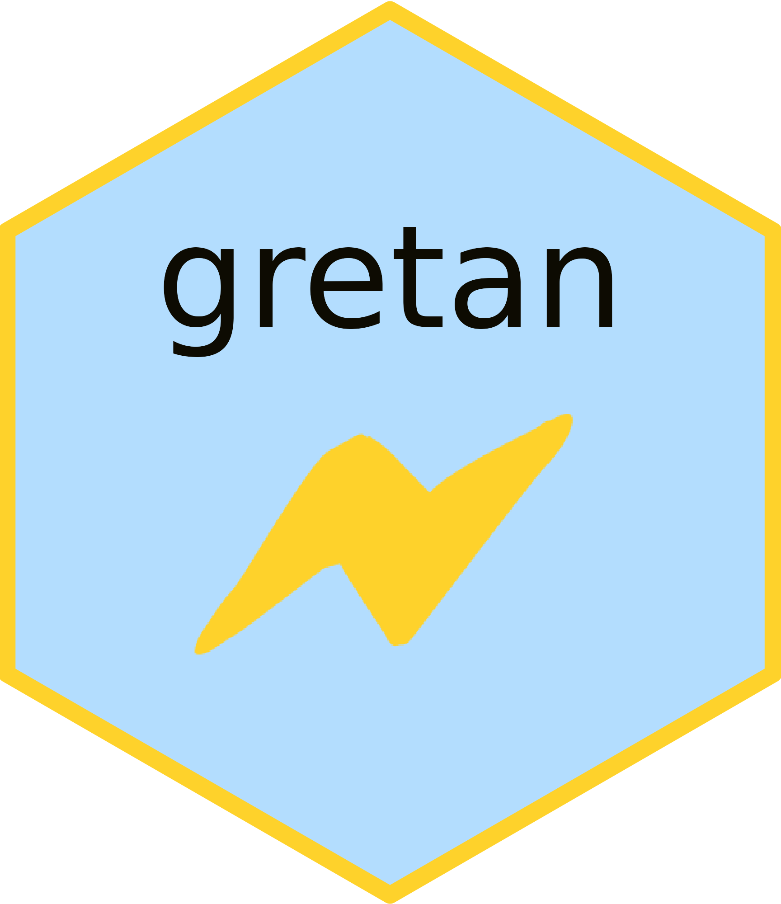

<!-- badges: start -->

[](https://github.com/JsLth/gretan/actions/workflows/R-CMD-check.yaml) [](https://codecov.io/gh/JsLth/gretan) [](https://opensource.org/licenses/Apache-2.0) [](https://doi.org/10.5281/zenodo.10051980)

<!-- badges: end -->


# GRETA Analytics <a href="https://zenodo.org/communities/greta/"></a>

GRETA Analytics (package name: `{gretan}`) is the GIS tool of the GRETA project (GReen Energy Transition Actions). The tool serves to present and visualize the research output of the project in an interactive fashion. It is specialized on spatial analysis and visualization, but hosts a variety of other information from the project. The package/app is built using the R [Shiny](https://github.com/rstudio/shiny) and [golemverse](https://golemverse.org/) frameworks and the UI framework [`{bs4Dash}`](https://rinterface.github.io/bs4Dash/)/[`AdminLTE3`](https://github.com/ColorlibHQ/AdminLTE).

The package is licensed under Apache 2.0.

## Getting started

### Web deployment

The app is deployed on [shinyapps.io](shinyapps.io) and can be accessed using the following link: https://projectgreta.shinyapps.io/greta-analytics.

### Binaries

The app is deployed as an Electron app using [`{electricShine}`](https://github.com/chasemc/electricShine). Binaries are released in the [OPCE database](https://zenodo.org/communities/greta/) of the GRETA project or [here](https://github.com/JsLth/gretan/releases).

### Running in R

The app is built under the `{golem}` framework and installs like an R package:

```r
devtools::install_github("JsLth/gretan")
library(gretan)
```

The Shiny app can then be run using the following command:

```r
run_greta()
```

Note that `gretan` requires a working Python >= 3.11 installation. Once installed,
`run_greta()` tries to automatically detect Python and optionally installs all
required dependencies.

## Contributing

GRETA Analytics is designed to incorporate contributions from researchers and stakeholders. If you have conducted research and/or data analyses related to energy citizenship, energy transitions, energy justice, or anything energy in the EU, take a look at our [contribution guidelines](CONTRIBUTION.md).

## Acknowledgements

GRETA Analytics was mainly developed by [Jonas Lieth](mailto:jonas.lieth@gesis.org) from [GESIS - Leibniz Institute for the Social Sciences](https://www.gesis.org/en/). The package and Shiny app was made possible thanks to the valuable contributions from various institutions including:

<table>
<thead>
  <tr>
    <th>Institution</th>
    <th>Contribution</th>
  </tr>
</thead>
<tbody>
  <tr>
    <td><a href="https://www.lut.fi/en">Lappeenranta-Lahti University of Technology</a><br></td>
    <td><a href="https://projectgreta.eu/wp-content/uploads/2023/09/GRETA_D2.4_Energy-citizen-empowerment-through-energy-data-interactions.pdf">Persona quiz based on energy citizen clusters</a><br></td>
  </tr>
  <tr>
    <td rowspan="2"><a href="https://www.tno.nl/en/">Dutch Organization for Applied Scientific Research (TNO)</<><br></td>
    <td><a href="https://github.com/TNO/pLAtYpus">pLAtYpus model for stakeholder interaction modelling</a></td>
  </tr>
  <tr>
    <td><a href="https://projectgreta.eu/wp-content/uploads/2023/01/GRETA_D3_2_Case-study-2-report_v1_0.pdf">Case study "Natural gas-free neighborhoods" wrap-up</a></td>
  </tr>
  <tr>
    <td rowspan="2"><a href="https://www.tecnalia.com/en/home">Tecnalia Research & Innovation</a><br></td>
    <td><a href="https://www.enerkad.net/">Energy assessment using the Enerkad tool</a><br></td>
  </tr>
  <tr>
    <td><a href="https://projectgreta.eu/wp-content/uploads/2023/01/GRETA_D3_4_Case-study-4-report_v1_0.pdf">Case study "UR Beroa" wrap-up</a>
  <tr>
    <td rowspan="2"><a href="https://www.unibo.it/">University of Bologna</a></td>
    <td><a href="https://projectgreta.eu/wp-content/uploads/2023/01/GRETA_D3_1_Case-study-1-report_v1_0.pdf">Case study "Pilastro-Roveri" wrap-up</a></td>
  </tr>
  <tr>
    <td>Fragility index</td>
  </tr>
  <tr>
    <td><a href="https://www.isi.fraunhofer.de/">Fraunhofer Institute for Systems and Innovation Research (ISI)</a><br></td>
    <td><a href="https://projectgreta.eu/wp-content/uploads/2023/01/GRETA_D3_5_Case-study-5-report_v1_0.pdf">Case study "Earnest app" wrap-up</a></td>
  </tr>
  <tr>
    <td><a href="https://cleanwatts.energy/">Cleanwatts Digital</a><br></td>
    <td><a href="https://projectgreta.eu/wp-content/uploads/2023/01/GRETA_D3_3_Case-study-3-report_v1_0.pdf">Case study "Coopérnico" wrap-up</a><br></td>
  </tr>
  <tr>
    <td><a href="https://kaskas.fi/en/">Kaskas Media</a></td>
    <td>Minor editing and design inspiration</td>
  </tr>
</tbody>
</table>


GRETA Analystics was developed as part of the [GRETA project](https://projectgreta.eu/), which has received funding from the European Union's HORIZON 2020 Research and Innovation programme under grant agreement N°101022317.
